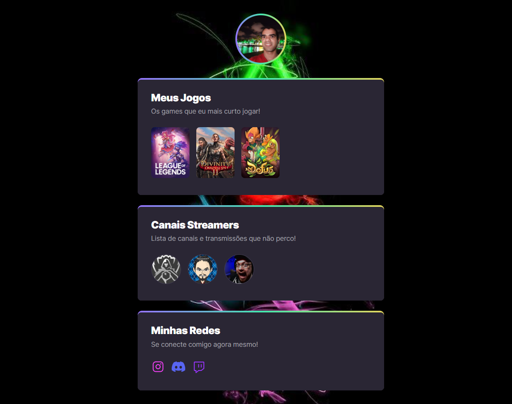

# NLW eSports - Trilha Explorer

    Projeto desenvolvido durante o evento Next Level Week da Rocketseat.

[🌐 Click aqui para acessar](https://josimar1628.github.io/Meu-Mundo-Gamer/)

## PREVIEW

## 💻 Tecnologias

- HTML
- CSS
- Git e GITHUB
- Figma

## 📚 Aprendizados

- Estrutura HTML, como visualizar a partir de um layout no Figma diversos blocos para traduzir em tags para o HTML;
- Estilização no CSS com o entendimento de camadas, animações, padrões do navegador;
- Versionamento de código;
- Portfólio no github.
- O maior desafio foi manter o foco diante de tantas possibilidades, otimização e gestão do tempo.
E foi o primeiro contato com o Figma, e achei incrível a estrutura montada no mesmo, ferramenta incrível.

## 📝Feedback

Feedback sempre são bem vindos, basta me adicionar e enviar uma mensagem [@josimar - jDe>](www.linkedin.com/in/josimar-jDev)

## 👨🏾‍🏫Professor

- [Mayk Brito](https://github.com/maykbrito)

## 👨🏾‍💻Autor

- [@josimar - jDe>](https://www.github.com/josimar1628)

